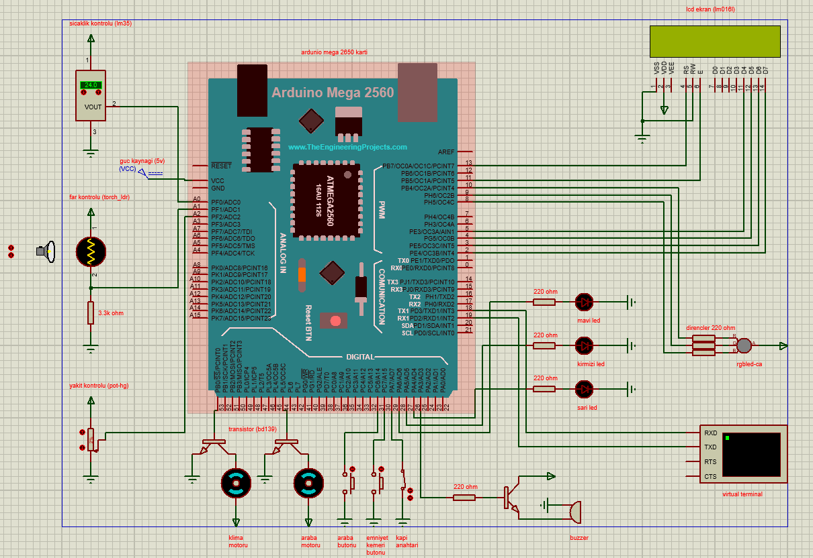

# 🚗 Arduino Car Control & Safety System Simulation

This project is a comprehensive **Vehicle Control and Safety System Simulation** developed using the **Arduino Mega 2560** microcontroller. It simulates the basic electronic functions of a car (engine control, headlights, air conditioning, safety systems, etc.) using a circuit designed in Proteus and Arduino C++ code.

## 🌟 About the Project

This simulation is designed to demonstrate the working logic of sensor-based automation and safety systems found in modern vehicles. The system continuously monitors environmental and internal factors such as temperature, light level, and fuel status to provide visual/auditory feedback to the driver and take automatic actions.

### Key Features

* **Engine Control System:** A safety lock that prevents the engine from running without the seat belt fastened and doors closed.
* **Automatic Headlight System:** Detects ambient light using an LDR sensor to automatically turn headlights on or off.
* **Smart Air Conditioning System:** Measures ambient temperature with an LM35 sensor and automatically activates the AC above a certain threshold (25°C).
* **Fuel Management System:** Displays the fuel level simulated by a potentiometer on the LCD screen, gives visual and written warnings at low levels, and automatically stops the engine when fuel runs out.
* **Door Safety System:** Provides a visual warning with an RGB LED and stops the engine when a door is opened.
* **LCD Information Display:** Transmits instant status information (Temperature, Fuel, Warnings) to the driver via a 16x2 LCD screen.

## 🛠️ Hardware Used (Simulation)

* **Microcontroller:** Arduino Mega 2560
* **Sensors:** LM35 (Temperature), LDR (Light), Potentiometer (Fuel Level).
* **Actuators:** DC Motors, 16x2 LCD Screen, RGB LED, Standard LEDs, Buzzer.
* **Driver:** BD139 Transistor.

## 🔌 Circuit Diagram and Installation

The Proteus circuit diagram of the project is located in the root directory.



### How to Run?

1.  Download/Clone this repository to your computer.
2.  Open `src/PROJE2A.ino` with Arduino IDE, compile it, and export the `.hex` binary file.
3.  Open the `simulation/PROJE2.pdsprj` file with **Proteus**.
4.  Double-click the Arduino Mega board and load the generated `.hex` file into the "Program File" section.
5.  Start the simulation.

## 📂 File Structure

```bash
.
├── simulation/
│   ├── PROJE2.pdsprj           # Proteus Project File
│   ├── ArduinoMega25602TEP.LIB # Library File
│   └── ArduinoMega25602TEP.IDX # Index File
├── src/
│   └── PROJE2A.ino             # Arduino Source Code
├── devre.png                   # Circuit Image
└── README.md                   # Project Documentation
```

## 📝 Code Summary
The project code is located in src/PROJE2A.ino and performs the following functions:

* **Sensor Reading:** Reads Temperature (LM35), Light (LDR), and Fuel (Potentiometer) data from analog pins.

* **Safety Control:** Continuously checks door and seat belt status within the loop cycle (digitalRead).

* **LCD Management:** Displays instant warnings on the screen using the LiquidCrystal library.

* **Actuator Control:** Triggers motors and LEDs when conditions are met.
